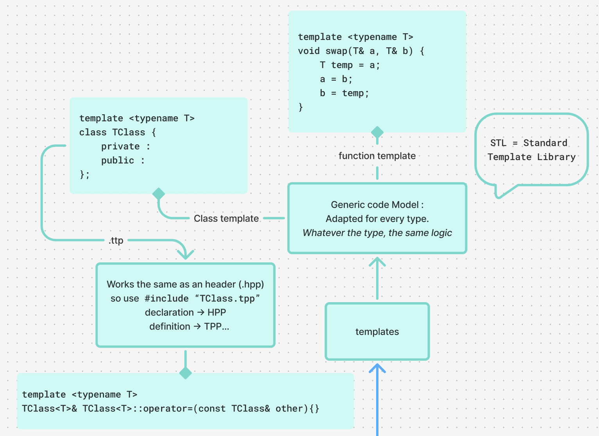

<!-- README.md -->
<p>This project has been created as part of the 42 curriculum by hlichten. </p>

<h1 align="center">
  CPP07
</h1>

<p align="center">
  <i>C++ module CPP07 – 42 Common Core</i><br>
  <strong>Developed in C++ by <a href="https://github.com/Hyliah">@Hyliah</a></strong>
</p>

<p align="center">
  
  
  
  
</p>

---

<h2>♦ Objective / Description♦</h2>

This module focuses on **templates in C++**, including:

- Function templates  
- Class templates  
- Template specialization  

The goal is to understand **how to write generic, reusable code** and implement **container-like structures** safely in C++98.

---

<h2>♦ Concepts Covered ♦</h2>

- Function templates (`max`, `min`, `swap`)  
- Class templates (`Array`)  
- Deep copy and orthodox canonical form  
- Exception handling with templates  
- Memory management for generic types

---

<h2>♦ Exercises ♦</h2>

| Exercise | Name | Description |
|----------|------|-------------|
| ex00 | Start with a few functions | Implement generic functions like `swap`, `min`, and `max` |
| ex01 | Iter | Implement a function template `iter` to apply a function on every element of an array |
| ex02 | Array | Implement a template class `Array<T>` with dynamic allocation, deep copy, bounds checking, and exceptions |

---

<h2> ♦ Compilation & Execution ♦</h2>

All projects are compiled using a Makefile with flags:  
`-Wall -Wextra -Werror -std=c++98`

Example usage:

```bash
make
./Array
```

---

<h2>♦ Personal Notes ♦</h2>

<p>[CPP07 : Templates]</p>


CPP - Homemade HelpCenter : 
<a href="https://www.figma.com/board/YLwrD2ZJmG2QEYdvLQ85o0/CPP_help-center?node-id=0-1&t=rvW7b2dDy1z6ygfJ-1">CPP HelpCenter</a>


---

<h2>♦ Ressorces ♦</h2>
Peer learning is a major part of the 42 experience.
Additional learning sources included:

- 42 Intra videos
- Official C++ documentation
- Discussions with peers

AI tools were used only to answer conceptual questions and help with debugging typos or logic issues,
not to generate the project code.

---

<h2>♦ Author ♦</h2>

42 login: hlichten
